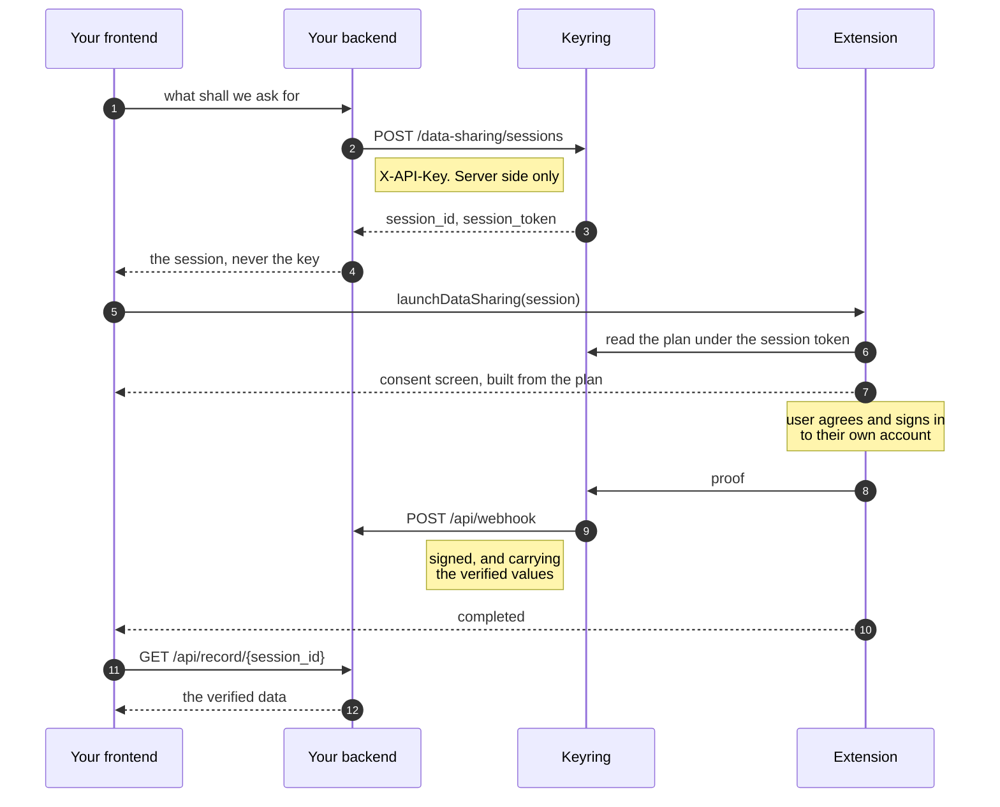
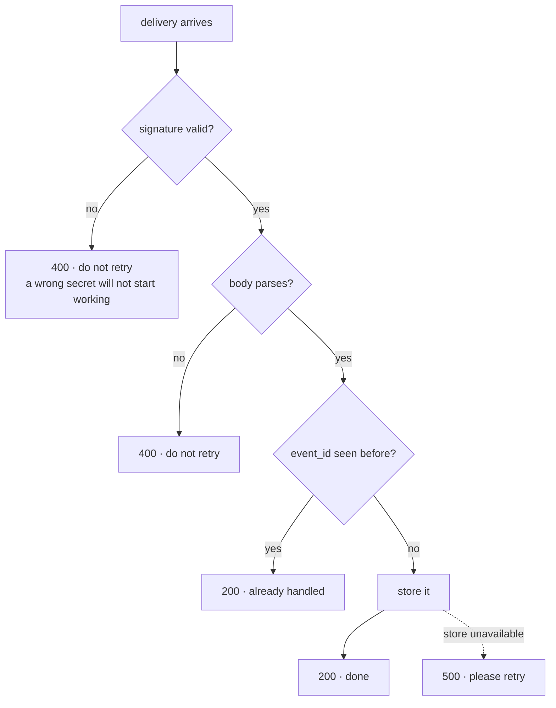

# Keyring Data Sharing Example

A partner integration in one Next.js app. A user shares verified data from an account they
already have — an exchange, say — and it arrives at this app's backend.

## The shape of it

The unusual part, and the reason this example exists:

**Your backend creates the session and receives the data. Your frontend never talks to
Keyring.**



Your API key stays on the server. The verified values never pass through the browser — they
go to your backend, and your own frontend reads them from there. That is what the last step
is doing.

## Running it

**1. Get provisioned.** Partners are set up by Keyring, so talk to us first. Tell us:

- **the fields you need** — `user.country`, `user.kyc_verified` and so on
- **the datasources you want to accept** — Binance, Kraken, Coinbase, …
- **your webhook URL** — where verified data should be delivered. Running this locally, that
  is `http://localhost:3000/api/webhook`

You get back an **API key** and a **webhook secret**.

**2. Configure.** Copy `.env.example` to `.env` and fill in the key and secret you were given.

**3. Install [Keyring Connect](https://chromewebstore.google.com/detail/keyring-connect/jgogeidclfccfoedhfjjaclnaojcllpi).**

**4. Run.**

```bash
pnpm --filter data-sharing dev
```

Then open http://localhost:3000, choose what to ask for, and click.

## What each file does

| Path                  |                                                            |
| --------------------- | ---------------------------------------------------------- |
| `src/lib/keyring.ts`  | Every call to Keyring. The only file that sees the API key |
| `src/lib/verify.ts`   | Webhook signature verification. **Copy this one**          |
| `src/lib/store.ts`    | Where deliveries are kept. **Replace this one**            |
| `src/app/api/partner` | What this partner may ask for. Drives the pickers          |
| `src/app/api/session` | Opens a request                                            |
| `src/app/api/webhook` | Where Keyring delivers                                     |
| `src/app/api/record`  | What we know about a request, values included              |
| `src/app/page.tsx`    | The whole UI                                               |

## Things worth knowing

**Verify over the raw bytes.** The signature covers `"<timestamp>.<raw body>"`. Re-serialising
the parsed JSON gives different bytes whenever key order or whitespace differ, and the
signature will not match. `src/app/api/webhook/route.ts` reads `await request.text()` before
anything parses it.

**Answer with the right status, and expect the same delivery twice.** Keyring retries a 429 or
a 5xx and gives up on anything else, so the code you return decides whether it comes back:



**`external_user_id` is yours.** Keyring has no idea who your user is. You send your own
identifier when opening the request and it comes back in the webhook, which is how you know
whose data arrived. Keyring never validates or resolves it — it only carries it. This app
sends a fixed `demo-user-1` and shows it coming back.

**The store is in memory.** It empties on restart and is not shared between instances. That is
fine for a demo and not fine for anything else — `src/lib/store.ts` is the file to replace with
your database.

**There is a fallback.** If no webhook has arrived when the page asks, `/api/record` reads the
record from Keyring with the API key instead, and the page says which route the data came by.
A real integration would rely on the webhook and treat this as the exception it is.
